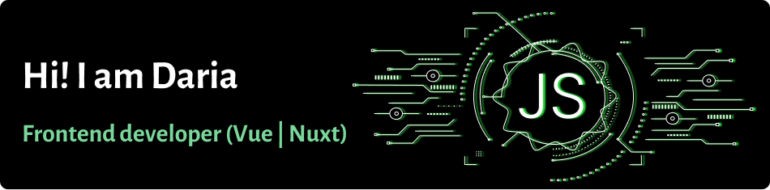

  <strong>Hi! I'm Daria 👋</strong> 
  A frontend developer who loves to turn ideas into clean, elegant code ✨ 
  Based in 🇺🇦 Ukraine

  
  

---

### 💻 About Me
I'm all about crafting smooth user experiences, solving tricky layout puzzles, and making the web a more beautiful place — one component at a time.

💡 Things that fuel my code:
- A good cup of coffee ☕
- Clean, reusable components
- Late-night debugging marathons (with music, of course 🎧)

🌱 Currently diving deeper into:
- TypeScript wizardry 🧙‍♀️
- Vue 3 Composition API
- Accessibility & performance best practices

🔍 I believe in:
- Writing code that *feels good* to read
- Learning something new every day
- The power of the “inspect element” tool 😄

---
### 🛠️ Tech Stack

  &nbsp;
  &nbsp;
  &nbsp;
  &nbsp;
  &nbsp;
  &nbsp;

---

### 🔥 My GitHub Stats

  
 
  

<!--
**boikodaria22/boikodaria22** is a ✨ _special_ ✨ repository because its `README.md` (this file) appears on your GitHub profile.

Here are some ideas to get you started:

- 🔭 I’m currently working on ...
- 🌱 I’m currently learning ...
- 👯 I’m looking to collaborate on ...
- 🤔 I’m looking for help with ...
- 💬 Ask me about ...
- 📫 How to reach me: ...
- 😄 Pronouns: ...
- ⚡ Fun fact: ...
-->
